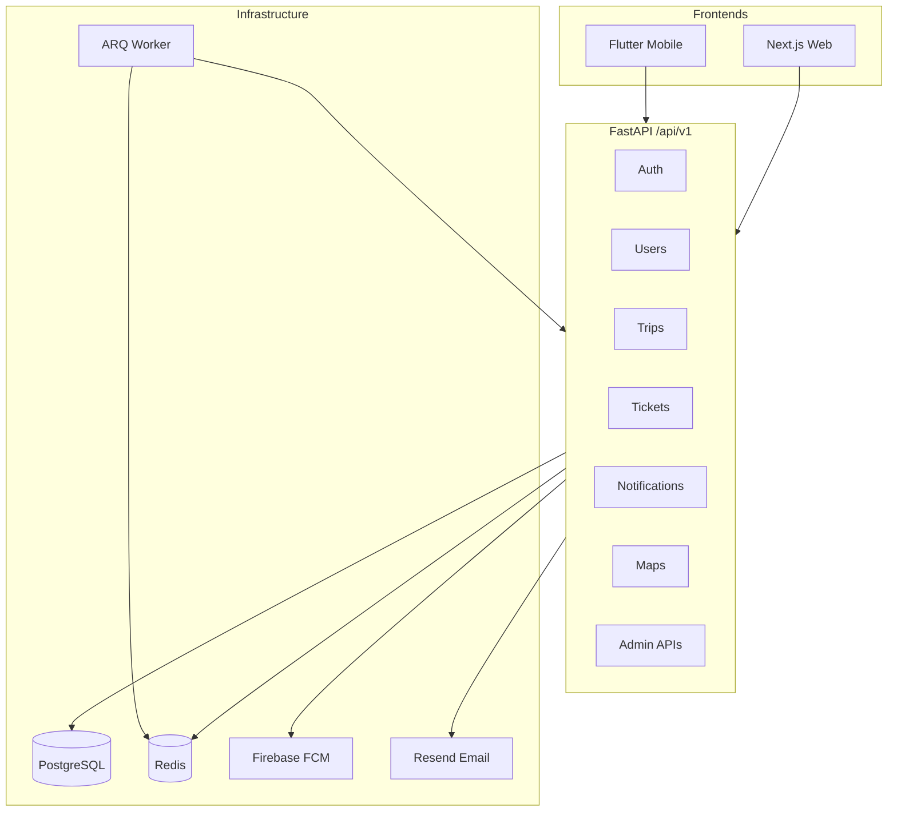

# Mosafer — Project Structure & API Reference

**الغرض:** مرجع تقني خام لتوثيق مشروع Mosafer (Backend + Frontends).  
**تاريخ التوليد:** 2026-06-09  
**قاعدة API:** `http://localhost:8001/api/v1` (Flutter Web/Desktop) · `http://10.0.2.2:8001/api/v1` (Android Emulator)

---

## 1. نظرة عامة على النظام

Mosafer منصة رفيق سفر ذكية تتكون من:

| الطبقة | التقنية | المسار |
|--------|---------|--------|
| **Backend API** | FastAPI (async), PostgreSQL, Redis, ARQ workers | [`app/`](app/) |
| **Mobile App** | Flutter + Riverpod + GoRouter | [`Flutter/app/lib/`](Flutter/app/lib/) |
| **Web App** | Next.js (حجز، دفع، لوحة إدارة) | [`web/`](web/) |



**المصادقة:** JWT (Bearer `access_token` + `refresh_token`). يُضاف التوكن تلقائياً عبر `ApiClient` في Flutter. عند `401` يُجرى refresh تلقائي ثم إعادة المحاولة.

**الصلاحيات:** RBAC عبر `require_permission(...)` — معظم endpoints الرحلات تتطلب `flights.read`.

---

## 2. تقسيم الموديلات الرئيسية (Modules / Subsystems)

### 2.1 موديلات مربوطة بتطبيق Flutter (Mobile)

| الموديل | Backend | Flutter |
|---------|---------|---------|
| **Authentication** | [`app/api/v1/auth.py`](app/api/v1/auth.py) | [`features/auth/`](Flutter/app/lib/features/auth/) |
| **User Profile & Preferences** | [`app/api/v1/users.py`](app/api/v1/users.py) | [`features/profile/`](Flutter/app/lib/features/profile/) |
| **Notifications & Push Devices** | [`notifications.py`](app/api/v1/notifications.py), [`devices.py`](app/api/v1/devices.py) | [`features/notifications/`](Flutter/app/lib/features/notifications/) |
| **Trips & Reservations** | [`trips.py`](app/api/v1/trips.py), [`reservations.py`](app/api/v1/reservations.py), [`tickets.py`](app/api/v1/tickets.py) | [`features/trips/`](Flutter/app/lib/features/trips/) |
| **Airports (lookup)** | [`airports.py`](app/api/v1/airports.py) | [`airport_name_resolver.dart`](Flutter/app/lib/features/trips/data/airport_name_resolver.dart) |
| **Maps Proxy** | [`maps.py`](app/api/v1/maps.py) | [`core/services/geocoding_service.dart`](Flutter/app/lib/core/services/geocoding_service.dart), [`google_directions_service.dart`](Flutter/app/lib/core/services/google_directions_service.dart) |
| **Core Network** | — | [`core/network/api_client.dart`](Flutter/app/lib/core/network/api_client.dart) |

### 2.2 موديلات Flutter بدون API (محلية / UI فقط)

| الموديل | الوصف | المسار |
|---------|-------|--------|
| **Explore** | عرض بيانات الرحلة النشطة محلياً | [`features/explore/`](Flutter/app/lib/features/explore/) |
| **Deleted Trips** | إخفاء رحلات محلياً (`DeletedTripsStore`) | [`features/trips/presentation/deleted_trips/`](Flutter/app/lib/features/trips/presentation/deleted_trips/) |
| **Notification Settings UI** | تبديلات محلية غير مربوطة بـ `user_preferences.notification_enabled` | [`notification_settings_state.dart`](Flutter/app/lib/features/profile/presentation/notification_settings/notification_settings_state.dart) |
| **Theme / Locale** | `SharedPreferences` | [`core/theme/`](Flutter/app/lib/core/theme/), [`locale_providers.dart`](Flutter/app/lib/core/localization/locale_providers.dart) |

### 2.3 موديلات Backend مربوطة بـ Web فقط (غير مستخدمة في Flutter)

| الموديل | الملف | الغرض |
|---------|-------|-------|
| **Flight Search & Booking** | `flights.py`, `checkout_sessions.py`, `reservations.py`, `orders.py` | بحث وحجز ودفع عبر الويب |
| **Payments** | `payments.py` | Stripe / mock checkout |
| **Admin Dashboard** | `admin_analytics.py`, `admin_staff.py` | إدارة المستخدمين والإيرادات |
| **Destinations AI Tips** | `destinations.py` | نصائح وجهة (API موجود، Flutter لا يستدعيه) |
| **Trip Feedback** | `trips.py` (feedback endpoints) | تقييم ما بعد الرحلة (Web/Backend فقط حالياً) |
| **Health** | `health.py` (v1/v2) | مراقبة الصحة |

### 2.4 Workers (خلفية — لا يستدعيها Flutter مباشرة)

| Worker | الجدولة | الملف |
|--------|---------|-------|
| `poll_flight_statuses` | كل 3 دقائق | [`flight_status_poller.py`](app/workers/flight_status_poller.py) |
| `check_departure_alerts` | كل 30 دقيقة | [`departure_alert.py`](app/workers/departure_alert.py) |

يُنشئان إشعارات عبر [`NotificationDispatcher`](app/services/notification_dispatcher.py).

---

## 3. Flutter Mobile — الوظائف المربوطة بالـ Backend

> **تنسيق الجداول:** كل صف = endpoint واحد مربوط فعلياً من كود Flutter.  
> **Pagination:** الاستجابات المُرقّمة تُرجع `{ items, total, page, page_size, total_pages }` — Flutter يستخرج `items`.

---

### 3.1 Authentication (المصادقة)

**Backend:** [`app/api/v1/auth.py`](app/api/v1/auth.py) · **Prefix:** `/api/v1/auth`  
**Flutter:** [`auth_repository_impl.dart`](Flutter/app/lib/features/auth/data/auth_repository_impl.dart), [`auth_session_controller.dart`](Flutter/app/lib/features/auth/presentation/auth_session_controller.dart), [`api_client.dart`](Flutter/app/lib/core/network/api_client.dart)

| اسم الدالة (Backend) | Endpoint | الوصف | المدخلات | المخرجات |
|----------------------|----------|-------|----------|----------|
| `login` | `POST /api/v1/auth/login` | تسجيل دخول وإصدار JWT | **Body:** `{ email, password }` | `{ message, authenticated, access_token, refresh_token }` → تُحفظ في SecureStorage |
| `register` | `POST /api/v1/auth/register` | إنشاء حساب جديد | **Body:** `{ name, email, password }` | `{ message, user_id, email, verification_link? }` — Flutter يستدعي `login` بعدها |
| `requestPasswordReset` → `forgot_password` | `POST /api/v1/auth/forgot-password` | طلب رابط إعادة تعيين كلمة المرور | **Body:** `{ email }` | `{ message, reset_link? }` |
| `resetPassword` → `reset_password` | `POST /api/v1/auth/reset-password` | تعيين كلمة مرور جديدة | **Body:** `{ token, new_password }` | `{ message }` |
| `logout` | `POST /api/v1/auth/logout` | إبطال التوكن الحالي | **Header:** `Authorization: Bearer` | `{ message }` + مسح التخزين المحلي |
| `refreshSession` / `_refreshAccessToken` | `POST /api/v1/auth/refresh` | تجديد access token | **Body:** `{ refresh_token }` | `{ access_token, refresh_token, token_type }` |
| `load` (session check) | `GET /api/v1/users/me` | التحقق من صلاحية الجلسة | **Header:** Bearer | `ProfileRead` — Flutter يتحقق فقط من نجاح الطلب |

**Endpoints Auth غير المستخدمة في Flutter:** `POST /auth/token` (OAuth2 form), `verify-email`, `reset-password` (GET redirect links).

---

### 3.2 User Profile & Preferences (الملف الشخصي)

**Backend:** [`app/api/v1/users.py`](app/api/v1/users.py) · **Flutter:** [`profile_repository.dart`](Flutter/app/lib/features/profile/data/profile_repository.dart), [`profile_guest_avatar.dart`](Flutter/app/lib/features/profile/presentation/profile_guest_avatar.dart)

| اسم الدالة (Backend) | Endpoint | الوصف | المدخلات | المخرجات |
|----------------------|----------|-------|----------|----------|
| `get_my_profile` | `GET /api/v1/users/me` | جلب ملف المستخدم | Bearer | `ProfileRead`: `id, email, role_id, role_name, is_active, is_email_verified, avatar_path, created_at, last_login, passenger{...}, admin{...}` |
| `update_my_profile` | `PATCH /api/v1/users/me` | تحديث الاسم/البريد/الهاتف | **Body:** `{ full_name?, email?, phone? }` | `ProfileRead` محدّث |
| `change_my_password` | `POST /api/v1/users/me/password` | تغيير كلمة المرور | **Body:** `{ current_password, new_password }` | `{ message }` |
| `upload_my_avatar` | `POST /api/v1/users/me/avatar` | رفع صورة الملف (multipart) | **Form:** `file` (image) | `ProfileRead` مع `avatar_path` |
| `get_my_avatar` | `GET /api/v1/users/me/avatar` | تحميل bytes الصورة | Bearer | `image/jpeg` أو `image/png` (bytes) |
| `get_my_preferences` | `GET /api/v1/users/me/preferences` | تفضيلات المستخدم (عنوان المنزل) | Bearer | `UserPreferenceRead`: `home_address, home_lat, home_lng, preferred_transport, language, currency, notification_enabled, updated_at` |
| `update_my_preferences` | `PATCH /api/v1/users/me/preferences` | تحديث عنوان المنزل | **Body:** `{ home_address?, home_lat?, home_lng? }` | `UserPreferenceRead` |

**غير مستخدم في Flutter:** `POST /users/me/passport`, `GET /users/me/passport`, `POST /passport/analyze`, كل endpoints `/users/admin/*`.

---

### 3.3 Notifications & Devices (الإشعارات)

**Backend:** [`notifications.py`](app/api/v1/notifications.py), [`devices.py`](app/api/v1/devices.py)  
**Flutter:** [`notifications_repository.dart`](Flutter/app/lib/features/notifications/data/notifications_repository.dart), [`notifications_controller.dart`](Flutter/app/lib/features/notifications/presentation/notifications_controller.dart), [`notification_push_listener.dart`](Flutter/app/lib/features/notifications/presentation/notification_push_listener.dart)

| اسم الدالة (Backend) | Endpoint | الوصف | المدخلات | المخرجات |
|----------------------|----------|-------|----------|----------|
| `list_notifications` | `GET /api/v1/notifications` | قائمة إشعارات المستخدم | **Query:** `page=1`, `page_size=20` | `PaginatedResponse<NotificationRead>`: كل عنصر `{ id, user_id, type, title, body, read, created_at }` |
| `mark_all_notifications_read` | `POST /api/v1/notifications/read-all` | تعليم الكل كمقروء | Bearer | `{ message }` |
| `mark_notifications_read` | `POST /api/v1/notifications/read` | تعليم إشعارات محددة | **Body:** `{ ids: int[] }` | `{ message }` — **ملاحظة:** مُعرّف في Backend، غير مستدعى حالياً من UI Flutter |
| `register_device` | `POST /api/v1/devices/register` | تسجيل FCM token للـ push | **Body:** `{ token, platform }` | `{ id, token, platform }` — يُستدعى بعد Login |

**إنشاء الإشعارات (Backend فقط — عبر Workers/Services):**

| `event_type` | المصدر | Push | Email |
|--------------|--------|------|-------|
| `flight_update` | `flight_status_poller` | نعم | لا |
| `gate_change` | `flight_status_poller` | نعم | نعم |
| `departure_reminder` | poller / `departure_alert` | نعم | لا |
| `departure_warning` | `departure_alert` | نعم | لا |
| `departure_urgent` | `departure_alert` | نعم | نعم |
| `payment_success` | `payments.py` | نعم | نعم |
| `payment_failed` | `payments.py` | نعم | لا |
| `payment_refunded` | `payments.py` / cancel | نعم | لا |
| `booking_canceled` | `reservation_cancel_service` | لا | لا |

---

### 3.4 Trips — Reservations & Tickets (الرحلات والحجوزات)

**Backend:** [`reservations.py`](app/api/v1/reservations.py), [`tickets.py`](app/api/v1/tickets.py)  
**Flutter:** [`trips_repository.dart`](Flutter/app/lib/features/trips/data/trips_repository.dart)

| اسم الدالة (Backend) | Endpoint | الوصف | المدخلات | المخرجات |
|----------------------|----------|-------|----------|----------|
| `list_my_reservations` | `GET /api/v1/reservations/me` | حجوزات المستخدم | **Query:** `page=1`, `page_size=50` | `PaginatedResponse<ReservationWithFlightRead>`: `id, user_id, flight_id, seat, status, total_price, currency, pnr, flight{...}, ticket_number, ticket_status, qr_code, seats[]` — Flutter يستبعد `canceled` |
| `scan_ticket_qr` | `POST /api/v1/tickets/scan` | مسح QR وإضافة رحلة | **Body:** `{ qr_payload }` | `QRScanResponse`: `ticket_number, ticket_status, reservation_id, reservation_status, flight{...}, issued_at` |
| `scan_ticket_image` | `POST /api/v1/tickets/scan-image` | تحليل صورة تذكرة بالـ AI | **Form:** `file` (image) | `TicketImageScanResponse`: `decision` (`valid_ticket`/`invalid_ticket`/`expired_ticket`), `extracted_fields`, `db_match?` |
| `list_my_tickets` | `GET /api/v1/tickets` | قائمة التذاكر | **Query:** `page`, `page_size` | `PaginatedResponse<TicketListItem>` |

**شاشات Flutter المرتبطة:** `my_trips_page`, `scan_page`, `ticket_details_page`, `airport_experience_page` (تستخدم `GET /tickets`).

---

### 3.5 Trips — Smart Travel Features (ميزات الرحلة الذكية)

**Backend:** [`trips.py`](app/api/v1/trips.py)  
**Flutter:** [`trips_repository.dart`](Flutter/app/lib/features/trips/data/trips_repository.dart) + شاشات: `on_way_page`, `plan_departure_page`, `airport_experience_page`, `airport_indoor_map_page`, `packing_page`, `timeline_page`, `trip_todos_page`

| اسم الدالة (Backend) | Endpoint | الوصف | المدخلات | المخرجات |
|----------------------|----------|-------|----------|----------|
| `get_departure_plan` | `GET /api/v1/trips/{reservation_id}/departure-plan` | حساب وقت المغادرة للمطار | **Path:** `reservation_id` · **Query:** `lat?, lng?, mode` (`driving`/`transit`/`walking`/`taxi`) | `DeparturePlanResult`: `leave_at, travel_minutes, distance_km, check_in_buffer_minutes, weather_buffer_minutes, weather{...}, transport_mode, traffic_level, flight_departure_at, encoded_polyline?` |
| `location_check` | `POST /api/v1/trips/{reservation_id}/location-check` | هل المستخدم في المطار؟ | **Body:** `{ lat, lng }` | `LocationCheckResponse`: `at_airport, distance_km, flight_status?, airport?, minutes_to_boarding?, departure_plan?` |
| `get_airport_dashboard` | `GET /api/v1/trips/{reservation_id}/airport-dashboard` | لوحة تجربة المطار الحية | **Query:** `lat, lng` | `AirportDashboardResponse`: `at_airport, flight_status, boarding, gate_suggestion, nearby_food_shops[], arrival_context?` |
| `get_airport_indoor_map` | `GET /api/v1/trips/{reservation_id}/airport-indoor-map` | خريطة داخلية (IST) | **Query:** `gate?, highlight?` (`coffee`/`food`) | `IndoorMapResponse`: `airport_iata, levels[], features[], pois[], supported, viewport?, route_points[], highlight_pois[]` |
| `get_packing_list` | `POST /api/v1/trips/{reservation_id}/packing-list` | قائمة تعبئة AI | **Header:** `Accept-Language` | `PackingListResult`: `must_have[], recommended[], optional[], weather?` |
| `generate_timeline` | `POST /api/v1/trips/{reservation_id}/timeline` | جدول زمني AI قبل الرحلة | **Header:** `Accept-Language` | `TimelineResult`: `items[{ days_before, title, description, category }]` |
| `populate_todos_from_packing_list` | `POST /api/v1/trips/{reservation_id}/todos/populate` | إنشاء مهام من قائمة التعبئة | Bearer | `TripTodoRead[]` |
| `list_trip_todos` | `GET /api/v1/trips/{reservation_id}/todos` | قائمة مهام الرحلة | **Query:** `category?, completed?` | `TripTodoRead[]`: `id, category, title, priority, is_completed, due_date?, source` |
| `create_trip_todo` | `POST /api/v1/trips/{reservation_id}/todos` | إنشاء مهمة | **Body:** `{ title, category?, priority? }` | `TripTodoRead` |
| `update_trip_todo` | `PATCH /api/v1/trips/{reservation_id}/todos/{todo_id}` | تحديث مهمة | **Body:** `{ title?, category?, priority?, is_completed? }` | `TripTodoRead` |
| `delete_trip_todo` | `DELETE /api/v1/trips/{reservation_id}/todos/{todo_id}` | حذف مهمة | **Path:** `reservation_id`, `todo_id` | `204 No Content` |

**Fallback محلي (Flutter فقط):** عند فشل `airport-indoor-map` لرحلات IST → `IndoorMapData.istOfflineFallback` في [`indoor_map.dart`](Flutter/app/lib/features/trips/domain/indoor_map.dart).

**غير مستخدم في Flutter:** `POST/GET .../feedback` (تقييم الرحلة).

---

### 3.6 Airports Lookup (أسماء المطارات)

**Backend:** `GET /api/v1/airports/{iata}/info` → `get_airport_info`  
**Flutter:** [`airport_name_resolver.dart`](Flutter/app/lib/features/trips/data/airport_name_resolver.dart)

| اسم الدالة | Endpoint | الوصف | المدخلات | المخرجات |
|------------|----------|-------|----------|----------|
| `get_airport_info` | `GET /api/v1/airports/{iata}/info` | تفاصيل مطار بكود IATA | **Path:** `iata` (3 حروف) | `AirportDetailRead`: `iata_code, name, city, country, latitude, longitude, terminal_info?, amenities?, map_url?` — Flutter يستخدم `name` فقط مع cache محلي |

---

### 3.7 Maps Proxy (الخرائط عبر Backend)

**Backend:** [`maps.py`](app/api/v1/maps.py)  
**Flutter:** [`geocoding_service.dart`](Flutter/app/lib/core/services/geocoding_service.dart), [`google_directions_service.dart`](Flutter/app/lib/core/services/google_directions_service.dart) — تُستخدم في `on_way_page`, `plan_departure_page`

| اسم الدالة | Endpoint | الوصف | المدخلات | المخرجات |
|------------|----------|-------|----------|----------|
| `geocode_address` | `GET /api/v1/maps/geocode` | تحويل عنوان إلى إحداثيات | **Query:** `address` | `{ formatted_address, lat, lng }` |
| `get_map_directions` | `GET /api/v1/maps/directions` | مسار طريق + polyline | **Query:** `origin_lat, origin_lng, dest_lat, dest_lng, mode` | `{ encoded_polyline, distance_km, travel_minutes, provider, routes[{ encoded_polyline, distance_km, travel_minutes, route_index, summary }] }` |

**خارج Backend:** على الموبايل، عند فشل proxy قد يستدعي Flutter مباشرة `maps.googleapis.com` (CORS bypass fallback).

---

## 4. Next.js Web — الوظائف المربوطة بالـ Backend

> تطبيق الويب يستخدم Next.js API routes كـ BFF تستدعي نفس Backend.  
> **غير مدرجة هنا بالتفصيل الكامل** — الملخص أدناه للمستشار التقني.

| الموديل Web | Endpoints Backend المستخدمة |
|-------------|----------------------------|
| Auth | `/auth/login`, `/auth/register`, `/auth/logout`, `/auth/refresh`, `/auth/forgot-password`, `/auth/reset-password` |
| Profile | `/users/me`, `/users/me/password`, `/users/me/avatar`, `/passport/analyze` |
| Flight Booking | `/flights/search`, `/flights/available-seats`, `/checkout-sessions`, `/checkout-sessions/{id}/passenger-details`, `/checkout-sessions/{id}/blocked-passports` |
| Reservations | `/reservations`, `/reservations/me`, `/reservations/{id}`, `/reservations/{id}/cancel`, `/reservations/{id}/passenger-details` |
| Payments | `/payments/config`, `/payments/create-session`, `/payments/stripe/verify`, `/payments/{id}` |
| Tickets | `/tickets/{ticket_number}`, `/tickets/{id}/download` |
| Admin | `/admin/dashboard`, `/admin/analytics/revenue`, `/admin/analytics/profit`, `/admin/reservations`, `/admin/staff`, `/admin/permissions`, `/users/admin/*`, `/tickets/report`, `/tickets/history` |
| Airports CRUD | `/airports` (POST/GET/PATCH/DELETE) — إدارة |

---

## 5. Backend — كامل الـ API (مرجع سريع)

**المجموع: 101 endpoint** في routers (+ `GET /`, `GET /metrics` على التطبيق).

| Router | Prefix | العدد | مستخدم في Flutter |
|--------|--------|-------|-------------------|
| health (v1) | `/api/v1` | 1 | لا |
| auth | `/api/v1/auth` | 10 | 6 |
| users | `/api/v1` | 15 | 7 |
| admin_staff | `/api/v1` | 5 | لا (Web) |
| admin_analytics | `/api/v1` | 4 | لا (Web) |
| airports | `/api/v1` | 6 | 1 (`/info`) |
| flights | `/api/v1` | 9 | لا (Web) |
| reservations | `/api/v1` | 7 | 1 (`/me`) |
| checkout_sessions | `/api/v1` | 4 | لا (Web) |
| orders | `/api/v1` | 1 | لا |
| tickets | `/api/v1` | 10 | 3 |
| notifications | `/api/v1` | 3 | 2 (+ read غير مستخدم) |
| payments | `/api/v1` | 7 | لا (Web) |
| devices | `/api/v1` | 2 | 1 |
| maps | `/api/v1` | 2 | 2 |
| destinations | `/api/v1` | 1 | لا |
| trips | `/api/v1` | 13 | 11 |
| health (v2) | `/api/v2` | 1 | لا |

---

## 6. هيكل الملفات الرئيسي

```
app/
├── api/v1/           # REST routers
├── core/             # config, jwt, rbac, cache
├── db/               # SQLAlchemy, migrations
├── models/           # ORM entities
├── schemas/          # Pydantic request/response
├── services/         # business logic, external APIs, AI
└── workers/          # ARQ cron (flight poller, departure alerts)

Flutter/app/lib/
├── app/              # MaterialApp, GoRouter
├── core/             # network, theme, services
├── features/
│   ├── auth/
│   ├── profile/
│   ├── notifications/
│   ├── trips/        # largest feature module
│   └── explore/
├── l10n/             # AR/EN localization
└── shared/           # shell, widgets, navigation

web/
├── src/app/          # Next.js pages + API routes (BFF)
└── src/components/   # UI + admin clients
```

---

## 7. خريطة الشاشات Flutter ↔ API

| شاشة Flutter | Route | APIs المستخدمة |
|--------------|-------|----------------|
| Login / Register / Forgot / Reset | `/login`, `/register`, ... | Auth endpoints |
| My Trips | `/trips` | `GET /reservations/me`, airport info |
| Scan Ticket | `/scan` | `POST /tickets/scan`, `POST /tickets/scan-image` |
| Trip Stage Hub | `/dashboard`, `/on-way`, `/airport-experience` | departure-plan, location-check, airport-dashboard |
| Indoor Map | `/airport-indoor-map` | `GET .../airport-indoor-map` |
| Plan Departure | `/plan-departure` | departure-plan, maps/directions, geocode |
| Packing | `/packing` | `POST .../packing-list` |
| Timeline | `/timeline` | `POST .../timeline` |
| Trip Todos | `/todos` | todos CRUD + populate |
| Notifications | `/notifications` | `GET /notifications`, read-all |
| Profile / Edit / Settings | `/profile`, `/settings` | `/users/me`, preferences, avatar |
| Change Password | `/change-password` | `POST /users/me/password` |

---

## 8. ملاحظات للتوثيق الأكاديمي

1. **فصل المسؤوليات:** Flutter = تتبع الرحلة بعد الحجز؛ Web = البحث والحجز والدفع والإدارة.
2. **بيانات محاكاة:** `MockFlightStatusService` وبحث الرحلات `mock` — ليست بيانات GDS حقيقية.
3. **AI Features:** packing-list, timeline, scan-image, passport analyze — تعتمد على OpenAI عند توفر المفتاح.
4. **الإشعارات:** تُنشأ server-side؛ Flutter يعرضها ويسجّل device token فقط.
5. **IST Indoor Map:** OpenLevelUp iframe على الويب + بيانات geo من Backend أو fallback محلي.

---

*هذا الملف مُولَّد من تحليل الكود المصدري. للتحديث بعد تغييرات API، أعد فحص `app/api/v1/` و `Flutter/app/lib/**/data/*_repository.dart`.*
