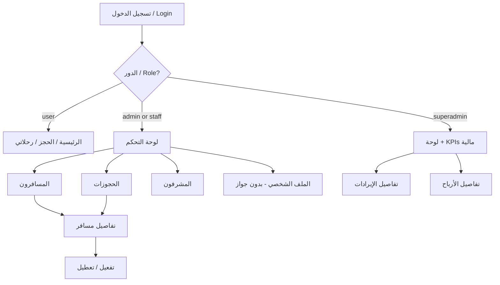

# توثيق واجهة الإدارة والمشرفين — Web Admin UI/UX

**Admin & Staff Dashboard — UI/UX Reference (Arabic + English)**

> **النطاق / Scope:** واجهة Next.js في `web/` — الحالة الحالية بعد refactor الإدارة.  
> **آخر مراجعة / Last reviewed:** يعكس الكود في `web/src/app/[locale]/admin/` وملحقاته.

---

## جدول المحتويات / Table of Contents

1. [نظرة عامة](#1-نظرة-عامة--overview)
2. [هيكل التنقل — ولماذا لا Sidebar](#2-هيكل-التنقل--navigation-architecture)
3. [نظام التصميم](#3-نظام-التصميم--design-system)
4. [الأدوار والصلاحيات](#4-الأدوار-والصلاحيات--roles--permissions)
5. [مرجع الصفحات](#5-مرجع-الصفحات--page-by-page-reference)
6. [الـ Header العام](#6-الـ-header-العام--global-header)
7. [مصادر البيانات والـ API](#7-مصادر-البيانات-والـ-api)
8. [مسارات المستخدم](#8-مسارات-المستخدم--user-flows)
9. [قيود معروفة وتحسينات مستقبلية](#9-قيود-معروفة--known-limitations)
10. [ملخص قرارات التصميم](#10-ملخص-قرارات-التصميم--design-rationale-summary)

---

## 1. نظرة عامة / Overview

### العربية

لوحة إدارة **مسافر** ليست تطبيقاً إدارياً منفصلاً، بل **امتداداً داخل نفس موقع الويب** الذي يستخدمه المسافرون للحجز. المشرفون والمديرون يدخلون عبر نفس نظام تسجيل الدخول، ويُوجَّهون تلقائياً إلى `/admin` بدلاً من واجهة الحجز.

**الفئات المستهدفة:**

| الفئة | الدور في الكود | ما يفعله في الواجهة |
|--------|----------------|---------------------|
| مدير النظام الرئيسي | `superadmin` | يرى الإيرادات، الأرباح، التحليلات، وكل العمليات التشغيلية |
| مشرف / Sub Admin | `admin` أو `staff-{uuid}` | يرى لوحة تشغيلية (مستخدمون، حجوزات، مدفوعات) **بدون** بيانات مالية حساسة |
| مسافر | `user` | لا يصل إلى `/admin` |

**الملفات الأساسية:**

| الملف | الوظيفة |
|-------|---------|
| `web/src/app/[locale]/admin/layout.tsx` | حماية الدخول + `AdminShell` |
| `web/src/components/admin/AdminShell.tsx` | Shell: sidebar + top bar + main |
| `web/src/components/SiteChrome.tsx` | إخفاء header المسافر على مسارات الإدارة |
| `web/src/components/admin/AdminDashboardClient.tsx` | لوحة التحكم (orchestrator) |
| `web/src/components/admin/DashboardKpiSection.tsx` | KPI grid + carousel |
| `web/src/components/admin/LatestBookingsTable.tsx` | جدول آخر الحجوزات |
| `web/src/lib/admin-roles.ts` | منطق تحديد الأدوار |

### English

The **Mosafer** admin panel is embedded in the same Next.js web app as passenger booking flows — not a standalone admin SPA. Admins share the global header and dark theme. Access is gated by `isAdmin` (layout) and granular RBAC permissions (API).

---

## 2. هيكل التنقل / Navigation Architecture

### 2.1 هل يوجد Sidebar؟ / Is There a Sidebar?

**نعم — There is a fixed right sidebar** داخل `AdminShell` لجميع مسارات `/admin/*` وملف المشرف على `/profile`.

```
┌────────────────────────────────────────────┬──────────────────────┐
│  ADMIN TOP BAR (logout · locale · bell)    │                      │
├────────────────────────────────────────────┤   SIDEBAR (fixed)    │
│                                            │   لوحة التحكم        │
│              PAGE CONTENT                  │   المسافرون          │
│         (KPI · tables · forms)           │   الحجوزات           │
│                                            │   المشرفون           │
│                                            │   (+ analytics SA)   │
│                                            │   ─────────────      │
│                                            │   Profile card       │
│                                            │   ADMIN badge        │
└────────────────────────────────────────────┴──────────────────────┘
```

| الطبقة | الملف | العناصر |
|--------|-------|---------|
| Shell | `AdminShell.tsx` | تخطيط sidebar + main + top bar |
| Sidebar | `AdminSidebar.tsx` | تنقل عمودي، بطاقة الملف في الأسفل |
| Top bar | `AdminTopBar.tsx` | عنوان الصفحة، تسجيل خروج، لغة |
| Site chrome | `SiteChrome.tsx` | يخفي `AppHeader`/`Footer` على `/admin` و`/profile` للمشرف |
| Layout | `admin/layout.tsx` | حماية الدخول + تمرير `profile` إلى Shell |

**ملاحظة:** صفحتا التحليل `/admin/analytics/revenue` و `/admin/analytics/profit` تظهران في الـ sidebar لـ Super Admin فقط، بالإضافة إلى كروت KPI القابلة للنقر.

---

### 2.2 قرار Sidebar / Sidebar Rationale

| # | العربية | English |
|---|---------|---------|
| 1 | **فصل تجربة المشرف** — `SiteChrome` يخفي header المسافر؛ المشرف يعمل داخل shell مخصص. | Admin shell replaces passenger chrome on admin routes. |
| 2 | **تنقل ثابت** — sidebar يمين (`w-64`) مع `pe-64` على المحتوى؛ active state `bg-white/10`. | Fixed right sidebar with consistent active highlighting. |
| 3 | **جوال** — drawer + hamburger عبر `AdminTopBar` على الشاشات الصغيرة. | Mobile drawer toggled from top bar. |
| 4 | **نفس الثيم الداكن** — `bg-[#071a31]`, `border-white/10` — **بدون تغيير palette**. | Dark theme preserved; layout-only refactor. |

---

### 2.3 خريطة المسارات / Route Map

| المسار | الصفحة AR | Page EN | الملف |
|--------|-----------|---------|-------|
| `/admin` | لوحة التحكم | Dashboard | `admin/page.tsx` → `AdminDashboardClient.tsx` |
| `/admin/analytics/revenue` | تفاصيل الإيرادات | Revenue Analytics | `admin/analytics/revenue/page.tsx` |
| `/admin/analytics/profit` | تفاصيل الأرباح | Profit Analytics | `admin/analytics/profit/page.tsx` |
| `/admin/users` | المسافرون | Passengers / Users | `admin/users/page.tsx` → `AdminUsersClient.tsx` |
| `/admin/users/[id]` | تفاصيل مسافر | User Detail | `admin/users/[id]/page.tsx` |
| `/admin/bookings` | الحجوزات | Bookings | `admin/bookings/page.tsx` |
| `/admin/staff` | المشرفون | Admin Staff | `admin/staff/page.tsx` → `StaffCreateForm.tsx` |
| `/profile` | الملف الشخصي | Profile (admin → `AdminProfileView`) | `profile/ProfileClient.tsx` |

**اللغات:** `/ar/admin/...` و `/en/admin/...` عبر `next-intl`.

---

## 3. نظام التصميم / Design System

### 3.1 الثيم والألوان / Theme & Colors

| Class / Token | الاستخدام AR | Usage EN |
|---------------|--------------|----------|
| `bg-[#061326]` / `bg-[#071a31]` | خلفية Header والصفحات | Page/header dark backgrounds |
| `bg-card` + `rounded-card` | بطاقات المحتوى | Content cards |
| `border-white/10` | حدود البطاقات والجداول | Card and table borders |
| `primary` | إجراءات رئيسية، روابط، حالات مفعّلة | Primary actions, links, active |
| `accent` | ملغى، معطّل، أخطاء | Cancelled, inactive, errors |
| `bg-green-500/20 text-green-400` | مؤكد / مكتمل | Confirmed / completed |
| `bg-yellow-500/20 text-yellow-400` | معلق / غير مُحقّق | Pending / unverified |
| `bg-[#0c1b31]` | رؤوس الجداول، حقول الإدخال | Table headers, form inputs |
| `rounded-mosafer` | أزرار، badges، حاويات صغيرة | Buttons, badges, chips |

### 3.2 الطباعة / Typography

| العنصر | Classes |
|--------|---------|
| عنوان الصفحة | `text-2xl font-black text-foreground` |
| عنوان القسم | `text-lg font-black text-foreground` |
| تسميات الحقول | `text-xs font-black uppercase text-muted` |
| قيم KPI | `text-3xl font-black` |
| نص ثانوي | `text-sm text-muted` |

### 3.3 أنماط التفاعل / Interaction Patterns

| النمط | التطبيق | السلوك |
|-------|---------|--------|
| كروت قابلة للنقر | KPI cards مع `<Link>` | `hover:border-primary/40` + `transition-colors` |
| صفوف الجداول | كل `<tr>` في الجداول | `hover:bg-white/5 transition-colors` |
| فلاتر الحالة | أزرار All / Active / Pending | الخلفية تتطابق مع لون الحالة عند التفعيل |
| Badges | حالة الحجز/الحساب | `rounded-full px-3 py-1` + نقطة `h-1.5 w-1.5 rounded-full` |
| التحميل | كل الصفحات | نص `{t("loading")}…` — **لا skeleton loaders** |
| الأخطاء | فشل API | بطاقة `border-accent/30 text-accent` |

### 3.4 RTL / i18n

- المسارات الجوية دائماً `dir="ltr"` (مثل `IST → LHR`)
- Header: الإنجليزية = الشعار يساراً؛ العربية = الشعار يميناً (`brandFirst`)
- Sidebar الإداري: ثابت يميناً (`right-0 w-64`)؛ المحتوى `pe-64`

---

## 4. الأدوار والصلاحيات / Roles & Permissions

### 4.1 تعريف الأدوار / Role Definitions

| الكود | التسمية AR | Label EN | وصول لوحة التحكم |
|-------|-----------|----------|------------------|
| `superadmin` | مدير النظام الرئيسي | Super Admin | كامل — مالي + تشغيلي |
| `admin` | مشرف | Admin | تشغيلي فقط |
| `staff-{uuid}` | مشرف فرعي | Sub Admin / Staff | حسب الصلاحيات المعيّنة |
| `user` | مسافر | Passenger | لا وصول لـ `/admin` |

**كشف الدور في الواجهة:** `web/src/lib/admin-roles.ts`

```typescript
isAdminRole(roleName, hasAdminRecord)  // superadmin | admin | staff-*
isSuperAdminRole(roleName)             // superadmin فقط
```

---

### 4.2 نموذج الصلاحيات RBAC / Permission Model

- الصلاحيات = strings بصيغة `resource.action` (مثل `flights.read`, `users.admin.manage`)
- كل مشرف فرعي يحصل على دور فريد `staff-{uuid}`
- صلاحيات أساسية تُمنح تلقائياً (لا تظهر في UI): `users.profile.read`, `update`, `password`, `avatar`
- صلاحيات إدارة المشرفين (`admins.staff.*`) — Super Admin فقط يمكنه تعيينها

---

### 4.3 ماذا يستطيع كل دور إدارته؟ / Action Matrix

| الإجراء | Super Admin | مشرف بصلاحية | مشرف بدون صلاحية |
|---------|-------------|--------------|------------------|
| عرض لوحة التحكم (تشغيلي) | نعم | نعم (`users.admin.manage`) | لا وصول |
| عرض الإيرادات/الأرباح | نعم | مخفي + API 403 | مخفي |
| قائمة/بحث المسافرين | نعم | نعم | محظور API |
| تفعيل/تعطيل حساب | نعم | نعم | محظور API |
| قائمة/بحث الحجوزات | نعم | نعم | محظور API |
| إلغاء حجز من واجهة الإدارة | **لا يوجد UI** | — | — |
| إنشاء مشرف + صلاحيات | نعم | إن وُجدت `admins.staff.create` | خطأ |
| تعديل/حذف مشرف | **لا يوجد UI** | — | — |
| الملف الشخصي (بدون جواز) | نعم | نعم | — |

---

### 4.4 مقارنة ما يظهر في لوحة التحكم / Dashboard Visibility

| العنصر | Super Admin | مشرف عادي |
|--------|-------------|-----------|
| إجمالي الإيرادات (كرت قابل للنقر) | مرئي | **مخفي** |
| أرباح المنصة (كرت قابل للنقر) | مرئي | **مخفي** |
| المدفوعات المكتملة | مرئي | مرئي |
| الحجوزات المدفوعة | مرئي | مرئي |
| إجمالي المستخدمين | مرئي | مرئي |
| الحجوزات | مرئي | مرئي |
| مؤشرات التذاكر | مرئي | **مخفي** |
| عدد المشرفين | مرئي | مرئي |
| مخطط الإيرادات | مرئي | **مخفي** |
| أهم المسارات | مرئي | **مخفي** |
| جدول أحدث الحجوزات | مرئي | مرئي |
| صفحات `/admin/analytics/*` | متاح | رسالة «لا صلاحية» |

**حماية API:** الباكند يصفّر الحقول المالية لغير `superadmin` في `GET /admin/dashboard` — إخفاء UI وحده لا يكفي.

---

## 5. مرجع الصفحات / Page-by-Page Reference

---

### 5.1 لوحة التحكم — `/admin`

**الغرض AR:** نظرة تشغيلية سريعة على صحة النظام.  
**Purpose EN:** At-a-glance operational health and (for Super Admin) financial KPIs.

#### Wireframe (Super Admin)

```
┌─────────────────────────────────────────────────────────────┐
│  لوحة الإدارة                                               │
│  نظرة عامة على النظام والتحكم التشغيلي                      │
├─────────────────────────────────────────────────────────────┤
│  [إجمالي الإيرادات →]  [أرباح المنصة →]  [مدفوعات]  [حجوز]│
├─────────────────────────────────────────────────────────────┤
│  [مستخدمون →]  [حجوزات →]  [تذاكر]  [مشرفون →]              │
├─────────────────────────────────────────────────────────────┤
│  إجراءات سريعة: [إنشاء مشرف] [صلاحيات] [حجوزات] [مسافرون]  │
├─────────────────────────────────────────────────────────────┤
│  [مخطط الإيرادات]              [أهم المسارات]              │
├─────────────────────────────────────────────────────────────┤
│  أحدث الحجوزات                          [عرض الكل →]        │
│  ┌─────────────────────────────────────────────────────┐    │
│  │ بريد │ مسار │ مبلغ │ حالة │ تاريخ                    │    │
│  └─────────────────────────────────────────────────────┘    │
└─────────────────────────────────────────────────────────────┘
```

#### Wireframe (مشرف عادي — Moderator)

```
┌─────────────────────────────────────────────────────────────┐
│  [مدفوعات مكتملة]  [حجوزات مدفوعة]                          │
├─────────────────────────────────────────────────────────────┤
│  [مستخدمون →]  [حجوزات →]  [مشرفون →]                       │
├─────────────────────────────────────────────────────────────┤
│  إجراءات سريعة + جدول أحدث الحجوزات (نفس Super Admin)       │
│  (بدون: إيرادات، أرباح، تذاكر، مخطط، مسارات)                │
└─────────────────────────────────────────────────────────────┘
```

#### حقول البيانات / Data Fields

**API:** `GET /api/admin/dashboard` → `GET /api/v1/admin/dashboard`

| الحقل | التسمية AR | Moderator يرى؟ |
|-------|-----------|----------------|
| `total_revenue` | إجمالي الإيرادات | لا (صفر) |
| `revenue_this_month` | إيرادات هذا الشهر | لا |
| `platform_profit` | أرباح المنصة | لا |
| `profit_margin_pct` | الهامش (12%) | لا |
| `completed_payments` | المدفوعات المكتملة | نعم |
| `pending_payments` | معلقة | نعم |
| `refunded_payments` | مستردة | نعم |
| `paid_bookings` | حجوزات مدفوعة | نعم |
| `pending_bookings` | حجوزات معلقة | نعم |
| `canceled_bookings` | حجوزات ملغاة | نعم |
| `total_users` | إجمالي المستخدمين | نعم |
| `active_users` | المفعّلين | نعم |
| `total_tickets` | إجمالي التذاكر | لا |
| `valid_tickets` / `used_tickets` | صالحة / مستخدمة | لا |
| `staff_count` | عدد المشرفين | نعم |
| `monthly_revenue[]` | بيانات المخطط الشهري | لا |
| `top_routes[]` | أهم المسارات | لا (إيراد = 0) |
| `recent_bookings[]` | آخر 8 حجوزات | نعم |

#### الأزرار والروابط / Buttons & Links

| العنصر AR | النوع | الوجهة | من يراه |
|-----------|-------|--------|---------|
| إجمالي الإيرادات | Link (card) | `/admin/analytics/revenue` | Super Admin |
| أرباح المنصة | Link (card) | `/admin/analytics/profit` | Super Admin |
| عرض التفاصيل → | نص داخل الكرت | نفس الوجهة | Super Admin |
| إجمالي المستخدمين | Link (card) | `/admin/users` | الكل |
| الحجوزات | Link (card) | `/admin/bookings` | الكل |
| المشرفون | Link (card) | `/admin/staff` | الكل |
| إنشاء مشرف | Button-link | `/admin/staff` | الكل* |
| الصلاحيات | Button-link | `/admin/staff` | الكل |
| إدارة الحجوزات | Button-link | `/admin/bookings` | الكل |
| إدارة المسافرين | Button-link | `/admin/users` | الكل |
| عرض الكل | Text link | `/admin/bookings` | الكل |

\* قد يفشل API إن لم تكن صلاحية `admins.staff.create` متوفرة.

#### جدول أحدث الحجوزات / Recent Bookings Table

| العمود AR | Column EN | ملاحظات |
|-----------|-----------|---------|
| البريد | Email | `truncate` + `font-mono` |
| الرحلة | Flight | `dir="ltr"` — `IST → LHR` |
| الدفع | Payment | مبلغ USD |
| الحالة | Status | Badge ملوّن |
| التاريخ | Date | تاريخ ووقت محلي |

**ألوان الحالة:**

| الحالة | Class |
|--------|-------|
| مؤكدة / Confirmed | `bg-green-500/20 text-green-400` |
| معلقة / Pending | `bg-yellow-500/20 text-yellow-400` |
| ملغاة / Cancelled | `bg-accent/20 text-accent` |

#### حالات الواجهة / UI States

| الحالة | العرض |
|--------|-------|
| تحميل | `جاري التحميل…` |
| خطأ API | بطاقة حمراء/برتقالية مع `dashboardLoadError` |
| نجاح | كل الأقسام أعلاه |

---

### 5.2 تفاصيل الإيرادات — `/admin/analytics/revenue`

**الوصول:** Super Admin فقط — فحص `profile.isSuperAdmin` على السيرفر + API 403 للباقي.

**الغرض AR:** تحليل مصادر الدخل، اتجاه الإيرادات الشهرية، أداء المسارات، وتوزيع حالات الدفع.  
**Purpose EN:** Revenue trends, route performance, payment status breakdown.

#### Wireframe

```
┌─────────────────────────────────────────────────────────────┐
│  ← لوحة التحكم                    [عرض تفاصيل الأرباح]      │
│  تفاصيل الإيرادات                                           │
├─────────────────────────────────────────────────────────────┤
│  [إجمالي الإيرادات]     [إيرادات هذا الشهر]                 │
├─────────────────────────────────────────────────────────────┤
│  مخطط الإيرادات عبر الزمن (أعمدة تفاعلية + tooltip)         │
├──────────────────────────┬──────────────────────────────────┤
│  جدول أهم المسارات       │  جدول توزيع المدفوعات            │
│  مسار | حجوزات | إيراد   │  حالة | عدد | مبلغ               │
└──────────────────────────┴──────────────────────────────────┘
```

#### الأقسام والبيانات

| القسم | البيانات |
|-------|----------|
| كروت ملخص | `total_revenue`, `revenue_this_month` |
| مخطط | `monthly_revenue[]` — 12 شهر، hover يعرض المبلغ وعدد الحجوزات |
| أهم المسارات | `top_routes[]` — origin, destination, bookings, revenue |
| توزيع المدفوعات | `payment_breakdown[]` — status, count, amount |

**API:** `GET /api/admin/analytics/revenue`

**مكوّن المخطط:** `AnalyticsChart.tsx` — أعمدة CSS + tooltip عند hover/focus (بدون recharts).

---

### 5.3 تفاصيل الأرباح — `/admin/analytics/profit`

**الوصول:** Super Admin فقط.

**ملاحظة:** الأرباح = **12%** من الإيرادات (`PROFIT_MARGIN` في الباكند).

#### Wireframe

```
┌─────────────────────────────────────────────────────────────┐
│  ← لوحة التحكم                    [عرض تفاصيل الإيرادات]    │
│  تفاصيل أرباح المنصة                                        │
├─────────────────────────────────────────────────────────────┤
│  [أرباح]  [هامش 12%]  [إجمالي إيرادات]  [أرباح الشهر]     │
├──────────────────────────┬──────────────────────────────────┤
│  مخطط الأرباح عبر الزمن  │  مخطط الإيرادات عبر الزمن        │
├─────────────────────────────────────────────────────────────┤
│  جدول أهم المسارات                                          │
└─────────────────────────────────────────────────────────────┘
```

**API:** `GET /api/admin/analytics/profit`

---

### 5.4 المسافرون — `/admin/users`

**الغرض AR:** استعراض وبحث حسابات المسافرين والمشرفين.  
**Purpose EN:** Browse and search all user accounts.

#### Wireframe

```
┌─────────────────────────────────────────────────────────────┐
│  المسافرون    [إجمالي] [مفعّل] [معطّل] [مشرفون]            │
├─────────────────────────────────────────────────────────────┤
│  [بحث بالبريد/الاسم/الهاتف...]  [الكل] [مفعّل] [معطّل]      │
│  عرض X من Y مسافر                                           │
├─────────────────────────────────────────────────────────────┤
│  بريد | مسافر | حالة | دور | إجراءات                        │
│  ...  | ...   | badge| badge| [عرض →]                       │
└─────────────────────────────────────────────────────────────┘
```

#### البيانات والفلاتر

| العنصر | التفاصيل |
|--------|----------|
| شارات الإحصاء | total, active, inactive, admin count |
| البحث | email, full_name, phone |
| الفلاتر | الكل / مفعّل / معطّل |
| الجدول | email (+ unverified badge), passenger name/phone, status, role, View link |

**الإجراءات:** عرض التفاصيل فقط — لا تفعيل/تعطيل من القائمة.

**API:** `GET /api/admin/users?page=1&page_size=100`

**حالة فارغة:** `noUsersFound` في منتصف الجدول.

---

### 5.5 تفاصيل مسافر — `/admin/users/[id]`

**الغرض AR:** عرض بيانات حساب مسافر واحد وإدارة حالة التفعيل.  
**Purpose EN:** Single user account view with enable/disable actions.

#### Wireframe

```
┌─────────────────────────────────────────────────────────────┐
│  ← العودة للمسافرين                                         │
│  تفاصيل المسافر              [مفعّل] [مشرف]                 │
├─────────────────────────────────────────────────────────────┤
│  معلومات الحساب                                             │
│  بريد | معرف | دور | عضو منذ                                │
├─────────────────────────────────────────────────────────────┤
│  معلومات المسافر (إن وُجدت)                                 │
│  اسم | حالة الحساب | هاتف                                   │
├─────────────────────────────────────────────────────────────┤
│  إجراءات الحساب                                             │
│  [تفعيل]  [تعطيل]                                           │
└─────────────────────────────────────────────────────────────┘
```

#### الأزرار / Actions

| الزر AR | Button EN | API | السلوك |
|---------|-----------|-----|--------|
| تفعيل | Activate | `PATCH /api/admin/users/{id}/enable` `{is_active:true}` | معطّل إذا الحساب مفعّل |
| تعطيل | Disable | نفس الـ endpoint `{is_active:false}` | معطّل إذا الحساب معطّل |

**لا يُعرض:** صورة الجواز، سجل الحجوزات (تحسين مستقبلي).

**مكوّن:** `UserEnableButton.tsx`

---

### 5.6 الحجوزات — `/admin/bookings`

**الغرض AR:** مراقبة كل الحجوزات، البحث، والتصفية حسب الحالة.  
**Purpose EN:** Full booking oversight with search and status filters.

#### Wireframe

```
┌─────────────────────────────────────────────────────────────┐
│  الحجوزات   [إجمالي] [مؤكدة] [معلقة] [ملغاة]                │
├─────────────────────────────────────────────────────────────┤
│  [بحث برقم الحجز/التذكرة/البريد...]  [الكل][مؤكدة][معلقة]  │
├─────────────────────────────────────────────────────────────┤
│  حجز | مسافر | رحلة | مغادرة | حالة | سعر | إجراءات         │
│  #12 | email | CAI→DXB | datetime | badge | $XXX | [عرض]    │
└─────────────────────────────────────────────────────────────┘
```

#### أعمدة الجدول / Table Columns

| العمود AR | Column EN | المحتوى |
|-----------|-----------|---------|
| الحجز | Reservation | `#id` + ticket number |
| المسافر | Passenger | user email |
| الرحلة | Flight | `ORIGIN → DEST` + carrier/flight number |
| المغادرة | Departure | datetime محلي |
| الحالة | Status | badge + سطر فرعي لحالة الدفع |
| السعر | Price | amount + currency |
| إجراءات | Actions | «عرض المستخدم» → `/admin/users/{user_id}` |

**الفلاتر:** الكل / مؤكدة / معلقة — **لا زر ملغاة حالياً** (رغم وجود شارة إحصائية للملغاة).

**الإجراءات المتاحة:** عرض ملف المسافر فقط — **لا إلغاء حجز من الواجهة**.

**API:** `GET /api/admin/reservations?page=1&page_size=100`

---

### 5.7 المشرفون — `/admin/staff`

**الغرض AR:** إنشاء مشرفين جدد وتعيين صلاحياتهم.  
**Purpose EN:** Create staff accounts and assign RBAC permissions.

#### Wireframe

```
┌─────────────────────────────────────────────────────────────┐
│  إدارة المشرفين                                             │
├─────────────────────────────────────────────────────────────┤
│  نموذج إنشاء:                                               │
│  [بريد]  [كلمة مرور]                                        │
│  [اسم]   [هاتف]                                             │
│  ┌─ الصلاحيات (Permission Matrix) ─────────────────────┐    │
│  │ الرحلات    [قراءة ☑] [إدارة ☐]                      │    │
│  │ الحجوزات   [إنشاء ☐] [إلغاء ☐]                      │    │
│  │ ...                                                  │    │
│  └──────────────────────────────────────────────────────┘    │
│  [إنشاء مشرف]                                               │
├─────────────────────────────────────────────────────────────┤
│  المشرفون الحاليون (قائمة للقراءة فقط)                     │
│  اسم · بريد · دور · حالة · صلاحيات (نص)                     │
└─────────────────────────────────────────────────────────────┘
```

#### حقول النموذج / Form Fields

| الحقل AR | Field EN | مطلوب | التحقق |
|----------|----------|-------|--------|
| البريد | Email | نعم | `type=email` |
| كلمة المرور | Password | نعم | `minLength=8` |
| الاسم الكامل | Full name | نعم | نص |
| الهاتف | Phone | لا | اختياري |
| الصلاحيات | Permissions | نعم (≥1) | خطأ `staffPickPermission` |

#### مصفوفة الصلاحيات / Permission Matrix

**المكوّن:** `PermissionMatrix.tsx`

| خاصية UX | الوصف |
|----------|-------|
| التجميع | حسب `resource` من `resource.action` |
| التخطيط | صف لكل مورد — عنوان يسار/يمين + chips أفقية للأفعال |
| Chip محدد | `border-primary/50 bg-primary/15 text-primary` |
| Chip غير محدد | `border-white/15 hover:border-primary/30` |
| التمرير | `max-h-[28rem] overflow-y-auto` |
| الترجمة | `permResource_*` و `permAction_*` في `ar.json` / `en.json` |

**صلاحيات مخفية من الواجهة:** `admins.staff.read/create/update/delete` — Super Admin فقط يعيّنها عبر النظام.

#### قائمة المشرفين

عرض للقراءة: `full_name`, `email`, `role_name`, `is_active`, `permission_names` (نص مفصول بفواصل).

**قيود:** لا UI لتعديل أو حذف مشرف (الباكند يدعم PATCH/DELETE لكن لا BFF route في الويب).

**API:**
- `GET /api/admin/permissions`
- `GET /api/admin/staff`
- `POST /api/admin/staff`

---

### 5.8 الملف الشخصي — `/profile` (للمشرفين)

**الغرض AR:** إدارة حساب المشرف الشخصي (ليس حساب مسافر).  
**Purpose EN:** Admin self-service profile — no passenger/passport workflow.

#### ما يظهر / Shown

| القسم | الإجراءات |
|-------|-----------|
| صورة شخصية | رفع/تغيير Avatar |
| البيانات الشخصية | تعديل email, name, phone |
| إعدادات الحساب | تغيير كلمة المرور، تسجيل الخروج |

#### ما لا يظهر للمشرفين / Hidden for Admins

- **بطاقة صورة جواز السفر بالكامل** — الشرط: `!isAdminRole(...)` في `ProfileClient.tsx`
- **السبب:** الجواز مرتبط بجدول `passenger` لعملية الحجز؛ المشرف ليس مسافراً

---

## 6. الـ Header العام / Global Header

### سلوك المشرف vs المسافر

| العنصر | مسافر (user) | مشرف (admin/staff) |
|--------|--------------|---------------------|
| الرئيسية / Home | نعم | **لا** |
| رحلاتي / My Trips | نعم | **لا** |
| الملف الشخصي / Profile | نعم | نعم |
| لوحة الإدارة / Admin | لا | نعم (مميز بلون accent على `/admin/*`) |
| حجز رحلة / Book | نعم | **يُعاد توجيهه** بعيداً عن `/book` و `/trips` |
| بعد تسجيل الدخول | `/` أو الرحلات | `/admin` |

**الملف:** `web/src/components/AppHeader.tsx`  
**إعادة التوجيه:** `login/LoginForm.tsx`, `book/layout.tsx`, `trips/page.tsx`

---

## 7. مصادر البيانات والـ API

### 7.1 جدول Endpoints

| Endpoint (BFF) | Backend | الصلاحية | ملاحظة Super Admin |
|----------------|---------|----------|---------------------|
| `GET /api/admin/dashboard` | `/api/v1/admin/dashboard` | `users.admin.manage` | حقول مالية مصفّرة لغير superadmin |
| `GET /api/admin/analytics/revenue` | `/api/v1/admin/analytics/revenue` | `users.admin.manage` | 403 لغير superadmin |
| `GET /api/admin/analytics/profit` | `/api/v1/admin/analytics/profit` | `users.admin.manage` | 403 لغير superadmin |
| `GET /api/admin/users` | `/api/v1/users/admin` | `users.admin.manage` | — |
| `GET /api/admin/users/[id]` | `/api/v1/users/admin/{id}` | `users.admin.manage` | — |
| `PATCH /api/admin/users/[id]/enable` | enable endpoint | `users.admin.manage` | — |
| `GET /api/admin/reservations` | `/api/v1/admin/reservations` | `users.admin.manage` | — |
| `GET /api/admin/permissions` | `/api/v1/admin/permissions` | `admins.staff.read` | — |
| `GET /api/admin/staff` | `/api/v1/admin/staff` | `admins.staff.read` | — |
| `POST /api/admin/staff` | `/api/v1/admin/staff` | `admins.staff.create` | — |

### 7.2 طبقات الحماية / Security Layers

```
المستخدم
   ↓
[1] admin/layout.tsx — هل isAdmin؟
   ↓
[2] صفحات Analytics — هل isSuperAdmin؟ (server-side)
   ↓
[3] BFF routes — تمرير access_token
   ↓
[4] FastAPI RBAC — require_permission(...)
   ↓
[5] Business logic — redact financial data / 403 analytics
```

---

## 8. مسارات المستخدم / User Flows

### 8.1 مخطط الدخول والتنقل



### 8.2 مسار Super Admin — تحليل الإيرادات

```
Dashboard → [كرت إجمالي الإيرادات] → Revenue Analytics
                ↓
         مخطط شهري + جداول
                ↓
         [عرض تفاصيل الأرباح] → Profit Analytics
                ↓
         [← لوحة التحكم]
```

### 8.3 مسار المشرف العادي — عمليات يومية

```
Dashboard (بدون مالية) → الحجوزات → بحث/فلتر → عرض المستخدم
                      → المسافرون → تفاصيل → تفعيل/تعطيل
                      → المشرفون → إنشاء (إن وُجدت الصلاحية)
```

---

## 9. قيود معروفة / Known Limitations

| القيد AR | Limitation EN | التأثير |
|----------|---------------|---------|
| لا Sidebar | No sidebar | قد نحتاج drawer عند توسع الأقسام لـ 8+ |
| التحليلات ليست في sub-nav | Analytics not in sub-nav | صعوبة اكتشافها إلا من كروت Dashboard |
| لا تعديل مشرف من UI | No staff edit UI | PATCH/DELETE عبر API فقط |
| لا إلغاء حجز من الإدارة | No booking cancel in admin | المراقبة فقط |
| لا breadcrumb | No breadcrumb | روابط رجوع يدوية فقط |
| تحميل نصي فقط | Text-only loading | لا skeleton loaders |
| قائمة المشرفين نصية للصلاحيات | Staff permissions as comma text | صعوبة قراءة الصلاحيات الكثيرة |
| لا سجل حجوزات في تفاصيل المستخدم | No booking history on user detail | انتقال يدوي لصفحة الحجوزات |

### تحسينات UX مقترحة / Suggested UX Improvements

1. **أقسام إضافية في sidebar** (تقارير، إعدادات، رحلات) عند توسيع IA
2. **Breadcrumb** على صفحات التفاصيل
3. **Modal تعديل مشرف** مع إعادة استخدام `PermissionMatrix`
4. **Skeleton loaders** للجداول والكروت
5. **فلتر «ملغاة»** في صفحة الحجوزات (الشارة موجودة لكن الزر غير موجود)
6. **2FA فعلي** في `ProfileSecurityStack` (حالياً placeholder)

---

## 10. ملخص قرارات التصميم / Design Rationale Summary

| القرار | السبب المختصر AR | Rationale EN |
|--------|------------------|--------------|
| Sidebar ثابت يميناً | تنقل دائم + بطاقة ملف في الأسفل | Persistent nav + session card |
| Shell منفصل (`SiteChrome`) | إخفاء header المسافر على `/admin` | Admin UX isolated from booking flows |
| KPI carousel | metrics ثانوية مع vignette scroll | Secondary metrics in horizontal carousel |
| كروت KPI | قراءة سريعة للمديرين | Visual KPI scanning for managers |
| إخفاء مالي للمشرف (UI + API) | أمان — لا تسريب عبر Network tab | Defense in depth for financial data |
| Analytics من Dashboard فقط | بيانات مالية = مستوى ثانٍ | Financial data as drill-down, not daily nav |
| Permission Matrix | قابلية مسح أفضل من قائمة طويلة | Grouped RBAC scannability |
| بدون مكتبة charts | تقليل bundle في MVP | CSS charts, no recharts dependency |
| إخفاء جواز المشرف | المشرف ≠ مسافر | Admins are not passengers |
| فصل nav المشرف عن المسافر | workflows مختلفة | Admin manages system, doesn't book |
| جداول `table-fixed` | محاذاة ثابتة للمسارات والبريد | Consistent column widths, no awkward wrap |

---

## ملحق: قائمة المكوّنات / Component Index

| المكوّن | المسار | الوظيفة |
|---------|--------|---------|
| `AdminShell` | `components/admin/` | Shell layout |
| `AdminSidebar` | `components/admin/` | Sidebar + profile card |
| `AdminTopBar` | `components/admin/` | Top utilities bar |
| `AdminDashboardClient` | `components/admin/` | لوحة التحكم |
| `DashboardKpiSection` | `components/admin/` | KPI grid + carousel |
| `LatestBookingsTable` | `components/admin/` | جدول آخر الحجوزات |
| `AdminUsersClient` | `components/admin/` | جدول المسافرين |
| `StaffCreateForm` | `components/admin/` | إنشاء مشرف |
| `AdminProfileView` | `components/profile/` | ملف المشرف داخل shell |
| `RevenueAnalyticsClient` | `components/admin/` | صفحة الإيرادات |
| `ProfitAnalyticsClient` | `components/admin/` | صفحة الأرباح |
| `AnalyticsChart` | `components/admin/` | مخطط أعمدة تفاعلي |
| `PermissionMatrix` | `components/admin/` | مصفوفة صلاحيات |
| `UserEnableButton` | `components/admin/` | تفعيل/تعطيل حساب |
| `AppHeader` | `components/` | Header العام |
| `ProfileClient` | `profile/` | ملف شخصي (مع إخفاء جواز للمشرف) |

---

## ملحق: قائمة ملفات الترجمة ذات الصلة

مفاتيح `admin.*` في:
- `web/messages/ar.json`
- `web/messages/en.json`

أمثلة: `totalRevenue`, `platformProfit`, `staffPermissions`, `permResource_flights`, `permAction_read`, `analyticsNoAccess`, `viewDetails`.

---

*هذا المستند يصف الحالة الحالية للواجهة. أي تغيير في الكود يجب أن يُحدَّث هنا عند تعديل سلوك الإدارة.*

*This document reflects the current implementation. Update when admin UI behavior changes.*
