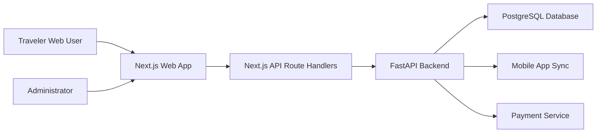

# Mosafer Web (Next.js)

The Mosafer web application is the project's administrative and booking interface. It supports the management of accounts that are pre-created or synchronized through the mobile app, while also giving travelers a web portal to log in, view their personal information, search for tickets, complete bookings, and confirm reservations through payment.

This component represents the administrative structure of the Mosafer system: it centralizes operational oversight, account control, booking visibility, and data synchronization with the FastAPI backend and the mobile application.

Authentication is handled through the FastAPI API using **httpOnly cookies** (`access_token`, `refresh_token`) set by route handlers under `src/app/api/`.

## Setup

1. Copy `.env.example` to `.env.local` and point `MOSAFER_API_BASE_URL` at your API (default `http://localhost:8001/api/v1`).
2. Ensure the API allows your origin in CORS (localhost:3000 is included by default in the backend).
3. Install and run:

```bash
npm install
npm run dev
```

Open `http://localhost:3000/en` or `http://localhost:3000/ar` (locale prefix is required).

## Scripts

- `npm run dev` — Next dev server
- `npm run build` — production build
- `npm run lint` — ESLint
- `npm run test` — Vitest unit tests

## Flows

- **Traveler:** home search → results → checkout (seat) → mock payment → confirmation with QR and `mosafer://ticket?...` deep link.
- **Admin:** `/admin` (requires `admin` profile on `/users/me`) — passengers list, enable/disable, ticket report.

## Web Application Plan

### Purpose

The web application is designed to serve two connected roles:

- **Traveler portal:** allows authenticated users to access their profile, search available flights or tickets, book tickets, pay for reservations, and receive confirmation details that stay synchronized with the mobile app.
- **Administrative interface:** allows administrators to monitor system activity, manage passenger accounts, disable accounts when required, review reservations, and oversee the booking lifecycle.

### Core Capabilities

- **Authentication and account access:** users can log in through the web interface using backend-issued session cookies and view account-specific information.
- **Account management:** administrators can review existing passenger accounts, inspect passenger details, and disable or reactivate accounts when necessary.
- **Ticket search and booking:** users can search for available tickets, select booking details, and proceed through checkout.
- **Payment confirmation:** reservations are confirmed only after the payment flow completes successfully, keeping booking state consistent with the backend.
- **Reservation and ticket visibility:** users and administrators can view reservation status, ticket details, QR/deep-link confirmation data, and related booking information.
- **System monitoring:** administrators can monitor active users, booking records, ticket reports, and operational activity from a centralized control panel.
- **Cross-platform synchronization:** bookings and tickets created on the web are stored through the FastAPI backend so they remain available to the mobile app.

### Administrative Scope

The admin panel is responsible for operational control rather than public marketing content. It should prioritize:

- Clear visibility into passengers, reservations, tickets, and account status.
- Safe account disable/enable actions with backend validation.
- Booking process oversight from search through payment confirmation.
- Data consistency with backend records used by both web and mobile clients.
- Localized English/Arabic UI with correct RTL/LTR behavior.

### Data Flow



### Implementation Notes

- The web app should continue to use Next.js route handlers as the browser-facing API layer.
- Session tokens should remain in httpOnly cookies and should not be exposed to client-side JavaScript.
- Admin-only pages must rely on backend role/profile checks, not only client-side routing.
- Booking, payment, and ticket confirmation flows should use backend APIs as the source of truth.
- Any new dashboard metrics should be derived from backend endpoints rather than duplicated client-side state.

## Refresh

`POST /api/auth/refresh` exchanges the httpOnly refresh cookie for a new pair (calls FastAPI `POST /auth/refresh`).
